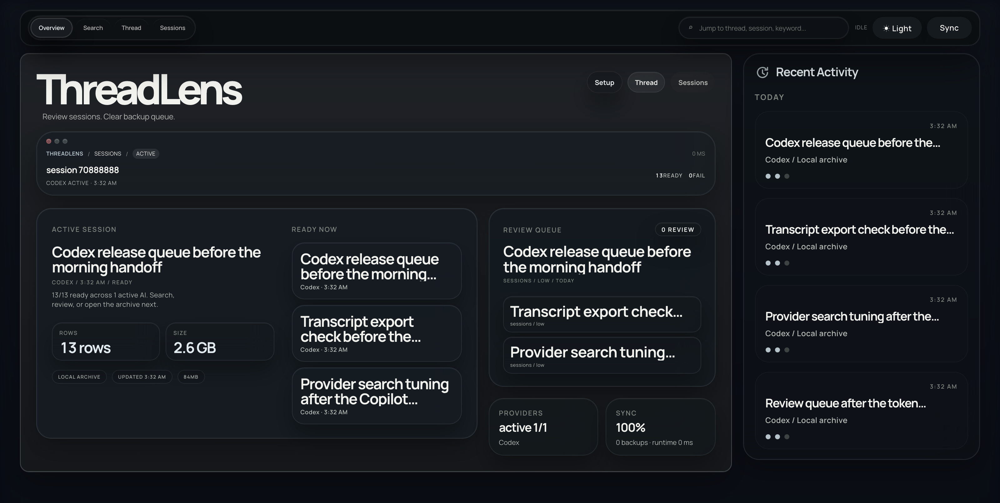
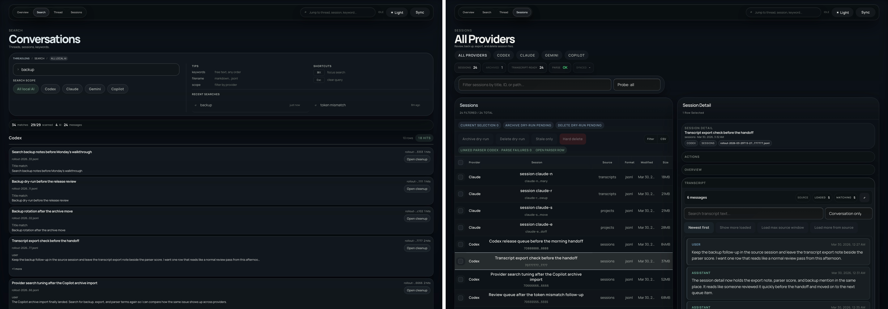
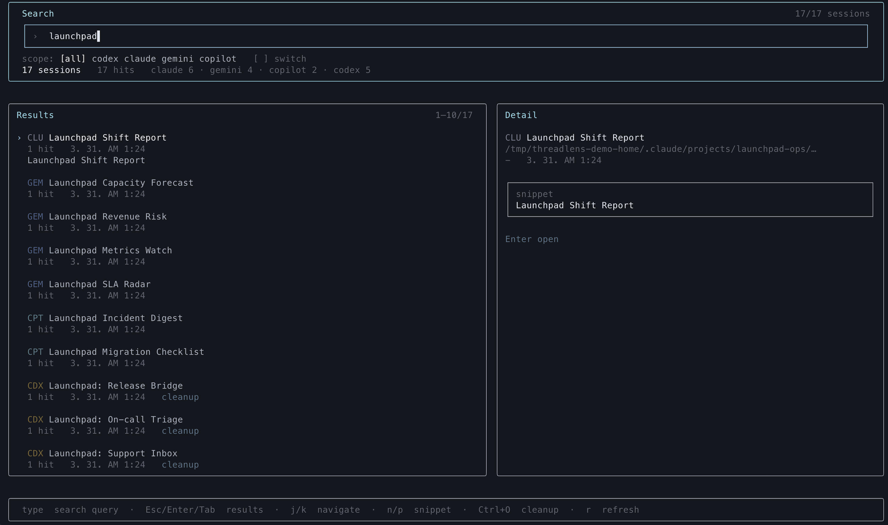
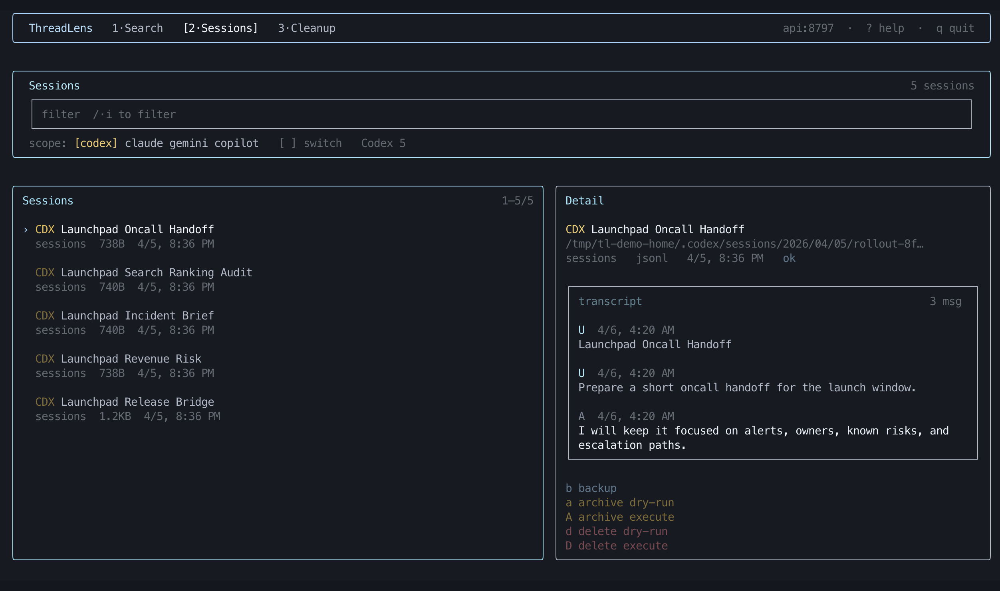

<h1>
  
  ThreadLens
</h1>

<p align="left">
  <a href="LICENSE"></a>
  <a href="https://nodejs.org"></a>
  <a href="https://pnpm.io"></a>
  <a href="https://github.com/hanityx/threadlens/actions/workflows/ci.yml"></a>
  
  
  
  
</p>

English | [한국어](docs/README.ko.md)

Local AI conversations pile up. ThreadLens lets you find them, read them, and clean them up safely.

Search across Codex, Claude, Gemini, and Copilot, inspect transcripts, back up session files, and delete only what you mean to — with dry-run confirmation before any file is touched.

## Overview

<p align="center">
  
</p>

<p align="center">
  <sub>Overview shows recent activity, provider health, and runtime signals across all connected providers.</sub>
</p>

## Demo

<p align="center">
  
</p>

<p align="center">
  <sub>Search by keyword across all providers, open a session, and read the transcript — no provider-specific folders to navigate.</sub>
</p>

## Core Workflows

<p align="center">
  
</p>

<p align="center">
  <sub>Search finds conversations by phrase across all providers. Sessions opens the raw session files, transcripts, and file-level actions.</sub>
</p>

<p align="center">
  
  
</p>

<p align="center">
  <sub>The TUI brings the same search and session workflows to the terminal, keyboard-first.</sub>
</p>

## Features

- **Multi-provider search** — find any conversation across Codex, Claude, Gemini, and Copilot by phrase or keyword
- **Transcript review** — open session files and read full transcripts without hunting through provider-specific folders
- **Backup first** — back up any session file before touching it; backup copies land in a timestamped local directory
- **Safe cleanup** — every destructive action requires a dry-run first; a confirm token gates the actual execute
- **Codex thread review** — dedicated workflow for inspecting thread impact and running targeted cleanup
- **Terminal workbench** — keyboard-first TUI that shares the same provider scope and local API
- **Web, TUI, and desktop** — all surfaces run against the same local Fastify API; no cloud required

## Getting Started

Runtime baseline: Node.js 22.12+ and pnpm 10.33.2+. The local `.nvmrc` pins the minimum Node 22 baseline used for development, while CI runs the supported Node 22 line.

```bash
pnpm install
pnpm dev
```

- Web UI: `http://127.0.0.1:5174`
- API: `http://127.0.0.1:8788`

```bash
pnpm dev:tui      # terminal workbench
pnpm dev:desktop  # Electron shell
```

## Desktop

Packages for macOS, Windows, and Linux are available via GitHub Releases. Local builds are unsigned by default — see [`apps/desktop-electron/README.md`](apps/desktop-electron/README.md) for build and signing details.

## Documentation

- [Architecture](docs/ARCHITECTURE.md)
- [Workflows](docs/WORKFLOWS.md)
- [Provider support](docs/PROVIDER_SUPPORT.md)
- [TUI guide](docs/TUI.md)
- [Design system](docs/DESIGN_SYSTEM.md)

## Contributing

Read [CONTRIBUTING.md](CONTRIBUTING.md) for dev setup, issue reporting, and the PR checklist.

## Security

Report vulnerabilities via [SECURITY.md](SECURITY.md) and GitHub private vulnerability reporting.

## License

[MIT](LICENSE)
