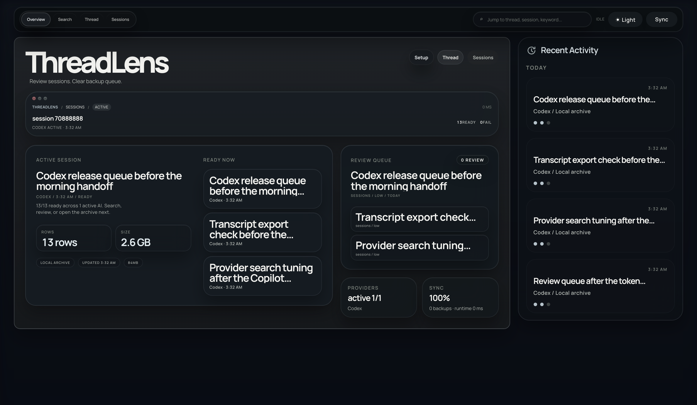

<h1>
  
  ThreadLens
</h1>

[](LICENSE)
[](https://nodejs.org)
[](https://pnpm.io)
[](https://github.com/hanityx/threadlens/actions/workflows/ci.yml)

ThreadLens is a local-first workbench for AI conversation search, provider-session review, and safe thread cleanup.

Search local conversations across Codex, Claude, Gemini, and Copilot, inspect transcripts, back up session files, and stop destructive work behind dry-run guardrails.

## Overview

<p align="center">
  
</p>

<p align="center">
  <sub>Start in Overview for recent activity, provider health, runtime recovery signals, and the default-AI setup that drives the rest of the workbench.</sub>
</p>

## Core Workflows

<p align="center">
  <sub>Start in Search when you know the phrase, then switch to Sessions when you need raw provider files and transcript detail.</sub>
</p>

<p align="center">
  
</p>

<p align="center">
  <sub>Search keeps phrase-first lookup readable, while Sessions keeps raw provider files and transcript detail open in the same workbench.</sub>
</p>

## Highlights

- `Conversation Search` finds the right session or thread before you pick a workflow.
- `Sessions` opens provider session files, transcript previews, and backup-first file actions.
- `Thread` gives Codex thread review, impact analysis, and dry-run token execution in a dedicated workflow.
- `Overview Setup` can save one default AI so `Sessions` and `Search` reopen from the same starting point.
- `Diagnostics` exposes runtime, parser, data-source, recovery, and execution-flow signals from the same local runtime.
- Web, TUI, and desktop all reuse the same Fastify API surface.

## Getting Started

```bash
pnpm install
pnpm dev
```

Default local endpoints:

- Web UI: `http://127.0.0.1:5174`
- TS API: `http://127.0.0.1:8788`

Optional surfaces:

- `pnpm dev:tui` starts the terminal workbench
- `pnpm dev:desktop` starts the Electron shell in development mode
- `sync-lens` is available as an optional read-only comparison surface for Codex state across machines

## Desktop Build Note

- Electron packaging is wired for unsigned local macOS builds.
- First launch can trigger Gatekeeper. Use `Open` from the context menu once, or allow the app in `System Settings > Privacy & Security`.
- Packaged outputs land in `apps/desktop-electron/dist/mac-arm64/ThreadLens.app` and `apps/desktop-electron/dist/*.zip`.
- Desktop-specific build details live in `apps/desktop-electron/README.md`.

## Documentation

- Architecture: `docs/ARCHITECTURE.md`
- Workflows: `docs/WORKFLOWS.md`
- Provider support: `docs/PROVIDER_SUPPORT.md`
- TUI guide: `docs/TUI.md`

## Contributing

See [CONTRIBUTING.md](CONTRIBUTING.md) for development guidelines.

## Security

See [SECURITY.md](SECURITY.md) for vulnerability reporting.

## Support

See [SUPPORT.md](SUPPORT.md) for bug-report, feature-request, and release-support guidance.

## License

[MIT](LICENSE)
