# Provider Observatory

[](LICENSE)
[](https://nodejs.org)
[](https://pnpm.io)
[](https://github.com/provider-surface/provider-surface/actions/workflows/ci.yml)

Local-first desktop control room for searching, reviewing, backing up, and safely cleaning up local AI conversations.

<!-- Demo: animated SVG showing all dashboard views (20s loop) -->
<p align="center">
  
</p>

Recommended product flow:
- `Conversation Search` when you only remember a phrase, filename, or old prompt
- `Codex Cleanup` when you want impact analysis, dry-runs, pin/archive, and cleanup review for Codex threads
- `Source Sessions` when you want raw session transcripts, selective backup, backup bundle export, and source-session actions across Codex, Claude, Gemini, and Copilot
- `AI Diagnostics` when you need operator-level path, parser, and execution-flow evidence

Provider Observatory helps manage large local AI histories with a product-first workflow:
- raw conversation search across providers
- Codex cleanup workflow with impact analysis and cleanup dry-run
- source-session browsing with transcript inspection and backup-first actions
- multi-provider diagnostics for Codex, Claude, Gemini, and optional Copilot
- recovery and backup export tooling
- desktop shell via Electron

Optional related-tools panel:
- set `THREADLENS_RELATED_TOOLS_JSON` to populate the `Related Tools` panel with your own local tool entries
- default behavior shows only Provider Observatory itself

```bash
export THREADLENS_RELATED_TOOLS_JSON='[
  {
    "name": "My Session CLI",
    "command": "my-session-cli",
    "running_pattern": "my-session-cli",
    "tmux_session": "my-session-cli",
    "start_cmd": "my-session-cli start",
    "watch_cmd": "tmux attach -t my-session-cli",
    "notes": "Local worktree/session helper"
  }
]'
```

Optional loop-control panel:
- set `THREADLENS_LOOP_CONTROLLERS_JSON` to expose local automation controllers in `AGI Loop Control`
- default behavior shows an empty loop panel and does not ship any controller scripts

```bash
export THREADLENS_LOOP_CONTROLLERS_JSON='[
  {
    "id": "nightly_sync",
    "label": "Nightly Sync",
    "controller": "./ops/nightly-sync-control.sh"
  }
]'
```

Runtime state location:
- default local state lives under `.run/state/`
- set `THREADLENS_STATE_DIR` to move roadmap, alert, checklist, and recovery-plan files elsewhere

## Tech Stack
- Desktop: Electron
- API: Node.js + TypeScript + Fastify
- Runtime: TypeScript-only Fastify API
- Web UI: React + Vite

## Repository Structure
- `apps/api-ts` Fastify gateway and TS routes
- `apps/web` dashboard frontend
- `apps/desktop-electron` desktop shell
- `packages/shared-contracts` shared types/contracts
- `scripts` dev/release automation scripts
- `docs` PRD, operations, troubleshooting, release docs

## Development
```bash
# from repository root
pnpm install
pnpm dev
pnpm dev:desktop  # optional Electron shell
```

Web UI: `http://127.0.0.1:5174`  
TS API: `http://127.0.0.1:8788`

## Core Commands
```bash
pnpm --filter @provider-surface/api test
pnpm --filter @provider-surface/api build
pnpm --filter @provider-surface/web test
pnpm --filter @provider-surface/web test:e2e
pnpm web:e2e:live
pnpm --filter @provider-surface/tests-api-contract test
pnpm oss:hygiene
pnpm public:verify
pnpm forensics:smoke
pnpm perf:smoke:strict
pnpm smoke:summary
pnpm build:desktop
pnpm release:preflight
```

Smoke outputs:
- Forensics: `.run/forensics/forensics-smoke-<timestamp>.{json,md}`
- Perf: `.run/perf/perf-smoke-<timestamp>.{json,md}`
- Summary: `.run/smoke/smoke-summary-<timestamp>.{json,md}`
- Hygiene: `pnpm oss:hygiene` blocks legacy product names, internal codenames, removed shell references, and raw `/user-root/...` leaks in tracked files.
- Public export verify: `pnpm public:verify` confirms the export is history-free, clean, and includes the expected release files.

## Desktop Artifacts
- Electron shell validation: `pnpm build:desktop`
- Electron unsigned package: `pnpm package:desktop:dir`
  - `.app`: `apps/desktop-electron/dist/mac-arm64/Provider Observatory.app`
  - `.zip`: `apps/desktop-electron/dist/*.zip` via `pnpm package:desktop`

## Release
- Preflight checklist: `docs/RELEASE_CHECKLIST.md`
- Signing/notarization guide: `docs/RELEASE_SIGNING.md`
- Local release quickstart: `docs/LOCAL_RELEASE_QUICKSTART.md`
- First public push guide: `docs/FIRST_PUBLIC_PUSH.md`
- Release notes draft: `docs/RELEASE_NOTES_0.1.0.md`
- Signing readiness check: `pnpm release:macos:doctor`
- Signing command: `pnpm release:macos:sign`
- Release bundle: `pnpm release:bundle`
- Release artifact cleanup: `pnpm release:artifacts:cleanup`
- Release status: `pnpm release:status`
- Public release prep: `pnpm release:public:prepare`
- Public release ready (recommended, no push): `pnpm release:public:ready`
- Public release stage (manual step): `pnpm release:public:stage`
- Public export command: `pnpm public:export`
- Public repo init: `pnpm public:init` or `pnpm public:init -- <export-dir>`
- Public push readiness: `pnpm public:push-ready`
- Public export verification: `pnpm public:verify`
- Stable aliases after running release scripts:
  - `.run/release-bundles/latest`
  - `.run/public-release/latest-clean`
  - `.run/public-release/latest-verified`
  - `.run/public-release/latest-stage`
- `latest-stage` is only updated by the official stage flow or by `pnpm public:init` when run against `latest-clean`; scratch/test exports do not replace it.
- `pnpm release:artifacts:cleanup` removes old scratch/test exports and stale bundles while preserving the current `latest-*` alias targets.
- `pnpm release:public:stage` now keeps the clean export and staged repo as separate directories from the same run.
- If `latest-clean` is newer than `latest-stage`, rerun `pnpm release:public:ready` before pushing.
- `pnpm release:public:ready` and `pnpm public:init` infer `origin` from `package.json` `repository.url` unless `PUBLIC_REMOTE_URL` overrides it.

## Product Surface
- `Overview`: runtime, smoke, recovery, and product guidance
- `Conversation Search`: search raw transcripts first, then jump into the correct workflow
- `Codex Cleanup`: Codex thread-focused review, impact analysis, and cleanup dry-run
- `Source Sessions`: provider-scoped session exploration and backup hub
- `AI Diagnostics`: advanced provider diagnostics and execution flow

## Contributing

See [CONTRIBUTING.md](CONTRIBUTING.md) for development guidelines.

## Security

See [SECURITY.md](SECURITY.md) for vulnerability reporting.

## Support

See [SUPPORT.md](SUPPORT.md) for bug-report, feature-request, and release-support guidance.

## License

[MIT](LICENSE)
